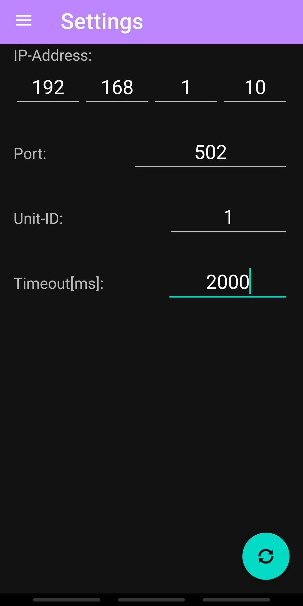
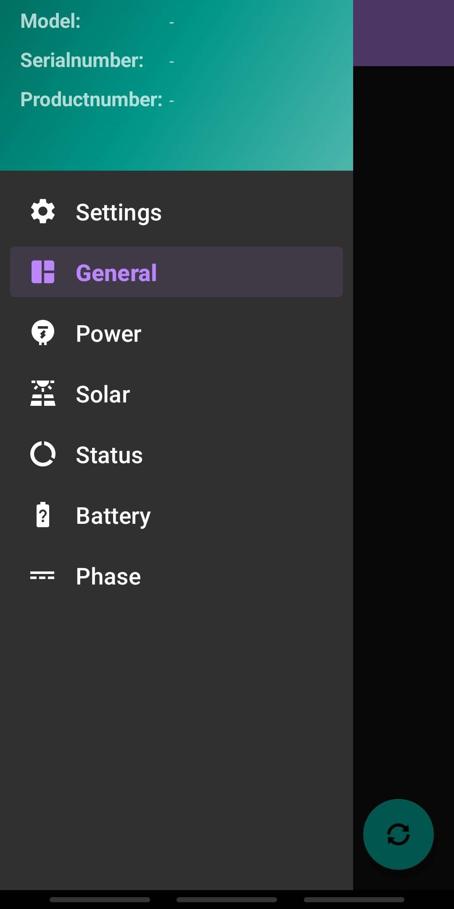
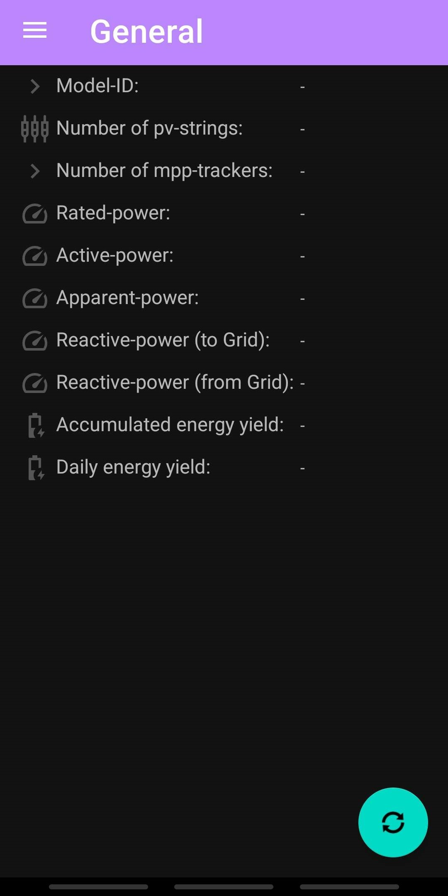
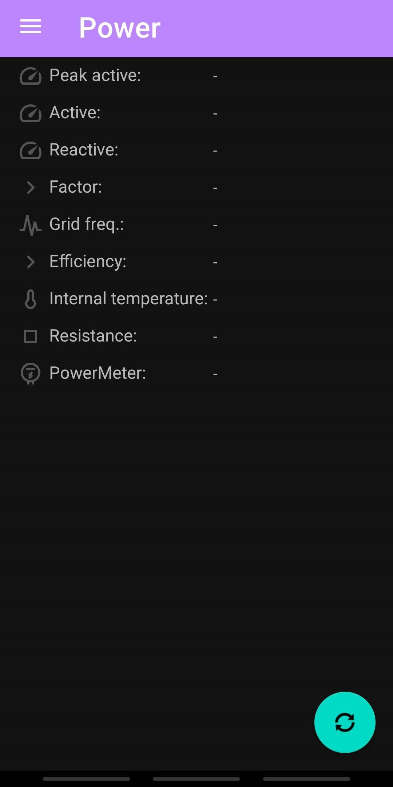
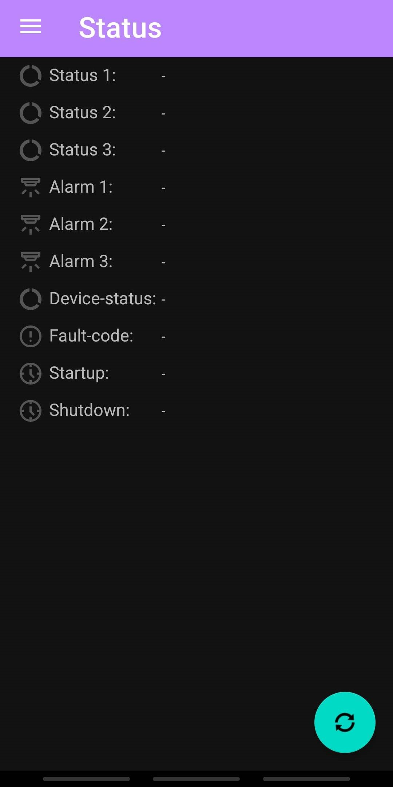
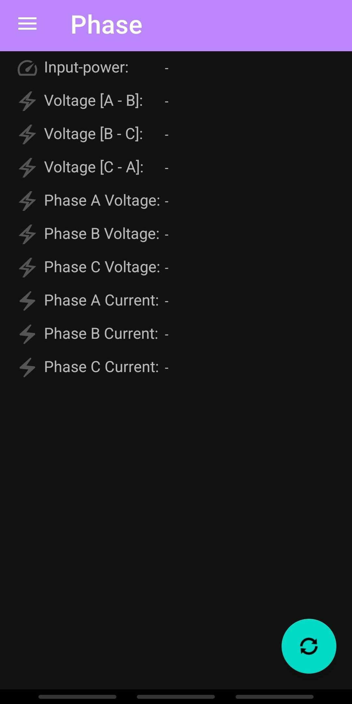

# Huawei Inverter ModBusTcp Data Reader

This Android application is designed as a efficient solution for reading data from Huawei Inverters via ModBusTcp. Please note that this application is intended for basic functionality and may lack extensive features typically found in more robust solutions.

### Features:
- **Data Retrieval:** Easily access essential data via ModBus.
- **Minimal Configuration:** No intricate setup required; simply input the necessary parameters within the Settings-Menu to connect via ModBus.

### Disclaimer:
**This application is provided as-is, without any warranties or guarantees of any kind, expressed or implied.** The developers, operating independently and without affiliation to Huawei or any related entities, offer this solution as a liberal contribution to the community. **Under no circumstances shall the developers be liable for any damages or issues arising from the use of this application.** Users are advised to exercise caution and discretion when utilizing this application, and to verify the accuracy of its output through alternative means. **By using this application, you agree to indemnify and hold harmless the developers from any and all claims, damages, losses, or liabilities that may arise.**

### License:
This application is distributed under the GPLv2 license. Refer to the accompanying license file for more information. 
- Note that this application uses vectorized clip-art provided by AndroidStudio under Apache License 2.0. Refer to the included license file within the resource directory for more information.

### About:
This application was developed by x47x72x65x67x6Fx72 with the aim of providing a quick and accessible solution for accessing data from Huawei-Inverters via ModBusTcp.

### AppDemo:

-

-

-

-

-

-

-
